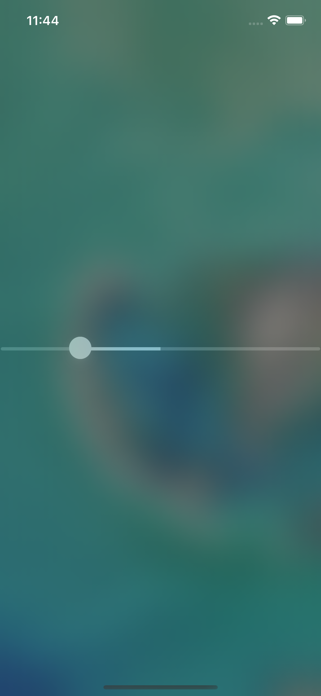
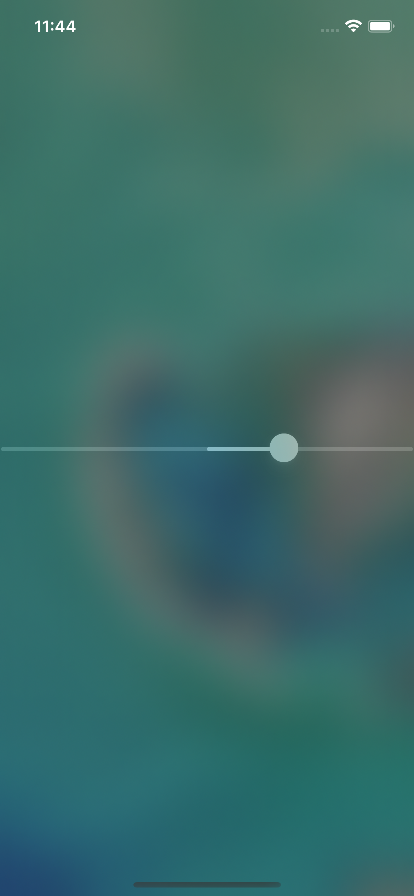
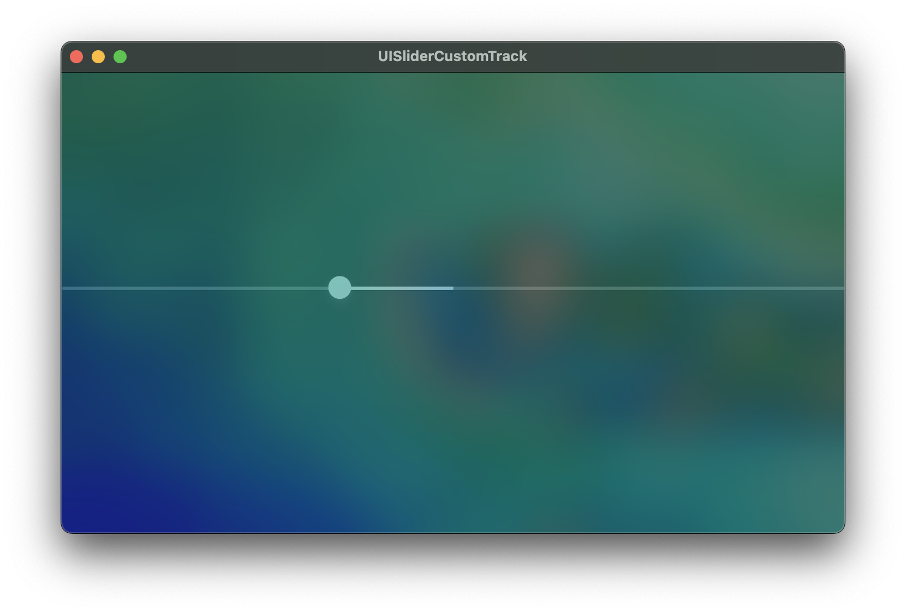

# UISliderCustomTrack

UISlider with Center aligned track bar.

## Usage

```objc
#import "UISlider+trackLocatedAtTheCenter.h"

UISlider *slider = [UISlider new];
slider.trackLocatedAtTheCenter = YES;
```

## Screenshots






